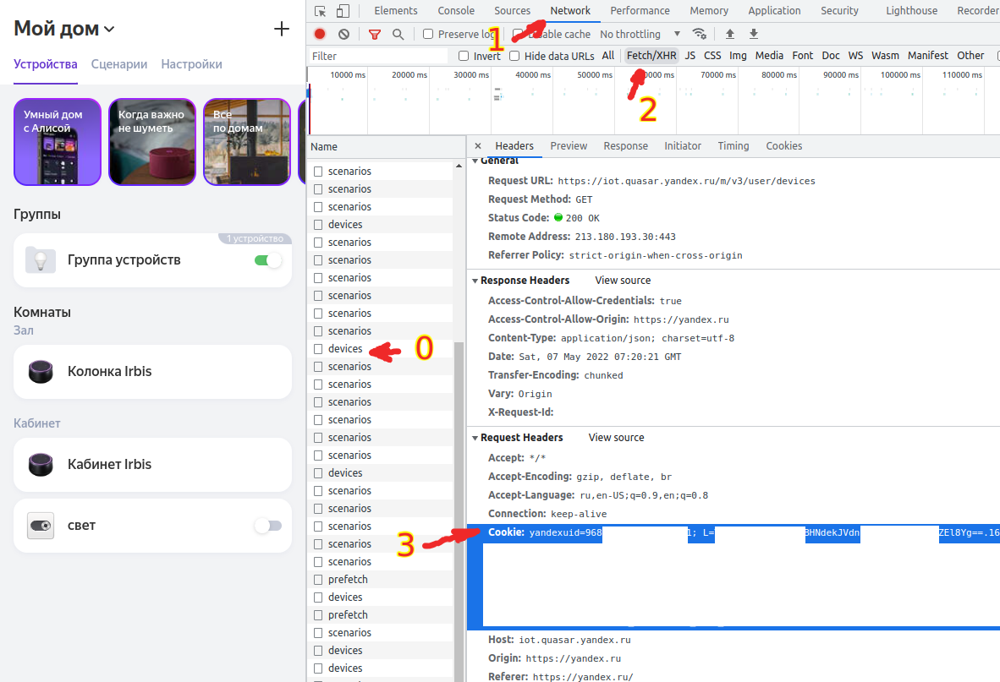

# Quasar PHP bundle for Alice devices 

Install by composer

``` bash
composer require decole/quasar-iot
```

Requirements:

```
"php": "^7.4||^8.0",
```

### Client for https://yandex.ru/quasar/iot/

It is bundle for Laravel and just for simple php projects, which will help send text messages to an 
audio smart devices via external api https://yandex.ru/quasar/iot/. Audio device with voice assistant Alice 
will be able to say what you sent without your manual voice activation.

## 100 characters limit per message !

I did it myself for voicing notifications and important notifications.

Optionally, if you use **Laravel**, you can publish the config file of this package with this command:

``` bash
$ php artisan vendor:publish --provider="Decole\Quasar\Adapters\Laravel\QuasarServiceProvider" --tag=config
```

## How to find cookies

Log in to https://yandex.ru/quasar/iot/

Press F11 in your browser to open "Developer Tools"

In the tab "Network" open any Fetch/XHR request and in the Request Headers copy the line from `Cookie:`. 
This **Cookie** string is needed for this library to work.



```php
$cookies = 'yandexuid=0000000000000000000; L=Ykkkkkkkkkk+awwwwwwwwwwwwwwwwwwwwwwwwwwwwwwwww==.1111111111.11111.111111.88888888888888888888888888888888; yandex_login=oooooooooo; yuidss=9999999999999999999; ymex=1111111111.yrts.1111111111; is_gdpr=0; is_gdpr_b=CCCCCCCCCCCC; my=YwA=; gdpr=0; _ym_uid=1111111111111111111; mda=0; amcuid=9999999999999999999; computer=1; XcfPaDInQpzKj=1; i=G4jBbeJV022E4y/HME9eMh/JJJJJJJJ+JJJJJJJ/JJJJJJJJ/ggggggggggggg+RRRRRRRRRRRRRRRRRRR+/H8dmxaI=; yp=1111111111.udn.cDDDDDDDDDDDDDDDDDDDDDDDDDD.org_id.333333333333333333.ygu.1#1111111111.spcs.l#1111111111.szm.1:111111111:1111111111111111111.los.1#1111111111.losc.0#1111111111.mcv.0#1111111111.mcl.1111111; device_id=11111111111111111111111111111111111111111; _ym_d=1111111111; skid=1111111111111111111; Cookie_check=1; instruction=1; Session_id=3:11111111111111111111111111111111111:24.1.2:1|111111111.0.2|3:111111.111111.11111111111111_111111111111; sessionid2=3:1111111111.5.0.1111111111111:111111:24.1.2:1|111111111.0.2|3:111111.111111.111111111111111111111111111; ys=udn.cccccccccccccccc#c_chck.1111111111; active-browser-timestamp=1111111111111; _ym_isad=2; _yasc=1111111111111111111111111111111111111111111111111111111111111111111www==';
$service = new QuasarClient($cookies);
$t = $service->getDevices();
dd($t); // view array data in browser

/* ------- */

// find needle deviceId to upper command and create scenario
$cookies = '...';
$deviceId = '55555555-eeee-4545-6767-dddddddddddd';
$service = new QuasarClient($cookies, 'Голос', $deviceId);
$t = $service->createScenario();
dd($t); // view string - it is $scenarioId

/* ------- */

// scenario was created, change message text by speech smart audio device
$cookies = '...';
$deviceId = '55555555-eeee-4545-6767-dddddddddddd';
$scenarioId = '44444444-ffff-4444-bebe-e8e8e8e8e8e8';
$service = new QuasarClient($cookies, 'Голос', $deviceId, $scenarioId);
$service->changeTextSpeechByScenario('Всем привет');
// and execute speech device
$service->executeSpeechByScenario();

// if need remove scenario
$service->deleteScenario();
```

### An example of the steps to use this library:

0. You need to add your smart speaker to the devices of your Yandex account.
   So that your device can be seen in https://yandex.ru/quasar/iot/.
1. Pull out **Cookie** of your account and save. This line is needed for the entire service to work. See picture above. 
2. Find the column id. the `$service->getDevices()` method will give you all your devices (in all houses and rooms)
3. You need to create a custom script if it doesn't already exist. For example, it could be a scenario named "Голос" 
   `$service->createScenario()`
4. Change the spoken text `$service->changeTextSpeechByScenario('Всем привет');` - 100 characters limit
5. Executing a voice message command `$service->executeSpeechByScenario();`
6. Deleting a scenario `$service->deleteScenario();`


## QuasarClient methods
------
```php
$service = new QuasarClient($cookies, 'Голос', $deviceId, $scenarioId);
// or
$service = new QuasarClient($cookies);
$service->setDeviceId($deviceId);
$service->setScenarioId($scenarioId);

// see all your devices
$service->getDevices();

// see all your devices filtered by <type> or <item_type>
$service->getDevices('device');

// create scenario
$service->createScenario();

// change voice message text
$service->changeTextSpeechByScenario('Всем привет');

// executing a voice message command
$service->executeSpeechByScenario();

// delete current scenario
$service->deleteScenario();
```

------
# Для Россиян и понимающих русский язык:


Установка через composer

``` bash
composer require decole/quasar-iot
```

Требования:

```
"php": "^7.4||^8.0",
```

### Клиент (api обертка) для https://yandex.ru/quasar/iot/

Обертка для Laravel, так и просто для проектов на php, которая поможет отправлять текстовые сообщения на аудиоколонку
через внешнее api https://yandex.ru/quasar/iot/. Колонка с голосовым помощником Алиса сможет
говорить то, что вы отправили без вашей голосовой активации.

## Ограничение на 100 символов в сообщении !

Делал себе для озвучивания нотификаций и важных сообщений.

При желании, если вы используете **Laravel**, вы можете опубликовать файл конфигурации этого пакета с помощью этой команды:

``` bash
$ php artisan vendor:publish --provider="Decole\Quasar\Adapters\Laravel\QuasarServiceProvider" --tag=config
```

## Как найти cookies

Зайти и авторизоваться на https://yandex.ru/quasar/iot/

Нажать на F11 в вашем браузере, чтобы открыть "Инструменты разработчика"

Dо вкладке "Network" открыть любой Fetch/XHR запрос и в Request Headers скопировать строку из
`Cookie:` параметра. Данная строка понадобиться, чтобы работы этой библиотеки. 


```php
$cookies = 'yandexuid=0000000000000000000; L=Ykkkkkkkkkk+awwwwwwwwwwwwwwwwwwwwwwwwwwwwwwwww==.1111111111.11111.111111.88888888888888888888888888888888; yandex_login=oooooooooo; yuidss=9999999999999999999; ymex=1111111111.yrts.1111111111; is_gdpr=0; is_gdpr_b=CCCCCCCCCCCC; my=YwA=; gdpr=0; _ym_uid=1111111111111111111; mda=0; amcuid=9999999999999999999; computer=1; XcfPaDInQpzKj=1; i=G4jBbeJV022E4y/HME9eMh/JJJJJJJJ+JJJJJJJ/JJJJJJJJ/ggggggggggggg+RRRRRRRRRRRRRRRRRRR+/H8dmxaI=; yp=1111111111.udn.cDDDDDDDDDDDDDDDDDDDDDDDDDD.org_id.333333333333333333.ygu.1#1111111111.spcs.l#1111111111.szm.1:111111111:1111111111111111111.los.1#1111111111.losc.0#1111111111.mcv.0#1111111111.mcl.1111111; device_id=11111111111111111111111111111111111111111; _ym_d=1111111111; skid=1111111111111111111; Cookie_check=1; instruction=1; Session_id=3:11111111111111111111111111111111111:24.1.2:1|111111111.0.2|3:111111.111111.11111111111111_111111111111; sessionid2=3:1111111111.5.0.1111111111111:111111:24.1.2:1|111111111.0.2|3:111111.111111.111111111111111111111111111; ys=udn.cccccccccccccccc#c_chck.1111111111; active-browser-timestamp=1111111111111; _ym_isad=2; _yasc=1111111111111111111111111111111111111111111111111111111111111111111www==';
$service = new QuasarClient($cookies);
$t = $service->getDevices();
dd($t); // выводим список устройств

/* ------- */

// находим нужный ID устройства, его поместим в переменную $deviceId. Мы ищем устройство - колонку. Интуитивно понятно.
$cookies = '...';
$deviceId = '55555555-eeee-4545-6767-dddddddddddd';
$service = new QuasarClient($cookies, 'Голос', $deviceId);
$t = $service->createScenario();
dd($t); // то что выведется, это id созданного сценария, помещаем в переменную $scenarioId

/* ------- */

// сценарий создан, теперь меняем текст внутри сценария, который при активации аудио колонка сама произнесет.
$cookies = '...';
$deviceId = '55555555-eeee-4545-6767-dddddddddddd';
$scenarioId = '44444444-ffff-4444-bebe-e8e8e8e8e8e8';
$service = new QuasarClient($cookies, 'Голос', $deviceId, $scenarioId);
$service->changeTextSpeechByScenario('Всем привет');
// выполняем активацию чтения нашего текста
$service->executeSpeechByScenario();

// если нужно удалить сценарий, воспользуйтесь командой ниже
$service->deleteScenario();
```

### Пример этапов применения данной библиотеки:

0. Нужно добавить вашу умную колонку в устройства вашей учетной записи Яндекса.
   Чтобы в https://yandex.ru/quasar/iot/ ваше устройство было видно.
1. Вытащить **Cookie** вашей учетной записи и сохранить. Данная строка нужна для работы всего сервиса. Смотри рисунок выше.
2. Найдите id колонки. метод `$service->getDevices()` выведет вам все ваши устройства (во всех домах и комнатах)
3. Нужно создать специальный сценарий, если его еще нет. Например, это может быть сценарий с именем "Голос"
   `$service->createScenario()`
4. Изменение озвучиваемого текста `$service->changeTextSpeechByScenario('Всем привет');` - ограничение в 100 символов
5. Выполнение команды озвучки сообщения `$service->executeSpeechByScenario();`
6. Удаление сценария `$service->deleteScenario();`

## QuasarClient методы
------
```php
$service = new QuasarClient($cookies, 'Голос', $deviceId, $scenarioId);
// или
$service = new QuasarClient($cookies);
$service->setDeviceId($deviceId);
$service->setScenarioId($scenarioId);

// посмотреть все ваши устройства
$service->getDevices();

// Посмотреть все устройства отфильтрованные по <type> или <item_type>. Смотри вывод предыдущей команды
$service->getDevices('device');

// создание сценария, с которым будет работать данная библиотека
$service->createScenario();

// изменение сообщения внутри сценария. Ограничение в 100 символов.
$service->changeTextSpeechByScenario('Всем привет');

// запустить сценарий чтения устройством данного сценария
$service->executeSpeechByScenario();

// удалить используемый сценарий
$service->deleteScenario();
```
